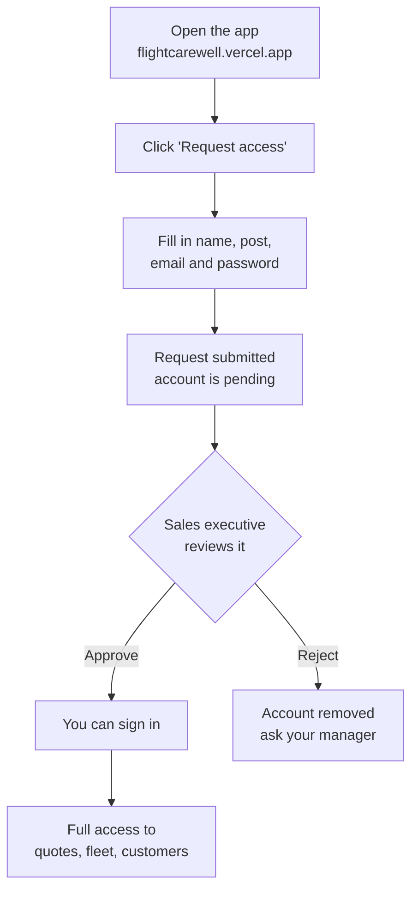

# Carewell Aviation — User Guide

A short guide for sales staff: how to get an account, sign in, and use the
quotation platform.

**Live app:** https://flightcarewell.vercel.app

---

## 1. Getting access

Accounts are **not** self-service. Anyone can request one, but a sales
executive has to approve it before sign-in works. This keeps client and
pricing data restricted to authorised staff.

### Requesting an account

1. Go to the app and click **Request access** at the bottom of the sign-in box.
2. Enter:
   - **Full Name** — appears on the quotations you produce
   - **Post / Job Title** — e.g. *Charter Consultant*
   - **Email** — your work email; this is your username
   - **Password** — at least 8 characters
3. Submit. You'll see a confirmation that the account is awaiting approval.

> You cannot sign in yet. Trying to will show
> *"Your account is still awaiting approval by a sales executive."*
> That message means everything worked — you just need approving.

### Getting approved

Tell a sales executive you've signed up. Once they approve you, sign in
normally — there's no confirmation email.

---

## 2. Approving people (sales executives only)

If you're an admin, a **Team** tab appears in the sidebar. It's hidden for
everyone else.

1. Open **Team**.
2. **Pending Approvals** lists everyone waiting, with the name, post and email
   they signed up with.
3. Check the person is who they say they are, then:
   - **Approve** — they can sign in immediately
   - **Reject** — deletes the request entirely
4. **Active Accounts** below shows everyone with access. Use **Revoke** to
   remove someone's access without deleting them.

You cannot revoke or delete your own account, so you can't lock yourself out.

---

## 3. Signing in

Enter your email and password. If something goes wrong, the message tells you
which problem it is:

| Message | What it means |
|---|---|
| *Invalid email or password* | Credentials are wrong. |
| *Awaiting approval by a sales executive* | Correct password — you just aren't approved yet. |
| *Could not reach the server…* | The backend is asleep or unreachable. Wait a minute, try again. |

> **First load can be slow.** The backend sleeps after ~15 minutes of
> inactivity on the free hosting tier, so the first request after a quiet
> period takes 30–60 seconds to wake up. It's fast after that.

---

## 4. What to explore

### Generate Quote
The main workflow.

- **AI Quote Assistant** — paste a client's request in plain English and it
  fills the form: name, company, phone, email, route, date, passengers,
  aircraft category and flight hours. Click *Try an example* to see it work.
- **Customer / Flight / Pricing** cards — everything is editable; the preview
  on the right updates as you type.
- **Aircraft Selection** — pick from the fleet. *View details* opens an editor
  for that aircraft.
- **Currency** — switch between USD, INR, JPY, EUR, GBP, AED and SGD.
- **Terms & Conditions** — editable per quote, one term per line, numbered
  automatically. *Reset to default terms* restores the standard five.
- **Live preview** — a real A4-sized page. If content overflows, it splits
  into multiple pages exactly where the PDF will.
- **Download / Print / Share / Regenerate** — Share offers *Email quotation*
  or *Copy link*; the link points at the saved PDF, so it keeps working after
  you close the app.

After generating, you'll be asked whether to add the client to **Customers**.
It's optional — nothing is saved unless you say yes.

### Aircraft
The full fleet. Click any aircraft to edit its name, manufacturer, category,
specs, description, hourly rate, main photo and gallery. **Add Aircraft**
creates a new one.

**Gallery rule:** the PDF only shows gallery photos in an **even number
(2 or 4)**. An odd count is skipped entirely so the row stays balanced. The
note beside the gallery turns green when you're set.

### Customers
Everyone you've saved from a quotation, plus anyone added by hand with
**Add Customer**.

- Every cell is editable — click and type.
- **Status** — New, Contacted, Quoted, Confirmed, Lost.
- **Business Done** — total value of that customer's quotations.
- **Columns** — show or hide any column; hidden ones are excluded from export.
- **Download CSV** — exports exactly what's on screen.
- The bin icon removes a customer (with confirmation).

### Coming soon
**Dashboard**, **Previous Quotes** and **Settings** are marked *Soon* in the
sidebar. They open placeholder pages describing what's planned.

---

## 5. Things worth knowing

- **Your data is saved.** Customers, aircraft, quotations and accounts all
  persist — nothing is lost when you close the browser or the app restarts.
- **Aircraft edits are shared.** Changing an hourly rate or photo affects the
  whole team and every future quotation, not just your own.
- **Gallery images** must be direct links to image files (ending `.jpg`,
  `.png`) if you paste a URL — a Google Images *search results* page won't
  work. Uploading a file is more reliable.
- **Quote links stay live.** A shared quotation link keeps working after the
  app restarts.

---

## Troubleshooting

**"Could not reach the server"** — the backend is waking up. Wait a minute.
If it persists, the backend may be down.

**Signed up but can't sign in** — you're waiting on approval. Ask a sales
executive to approve you in the Team tab.

**Photos not showing in the PDF** — check you have an even number (2 or 4) of
gallery images, and that any pasted URLs point directly at an image file.

**Numbers look wrong** — check the currency selector in Pricing Configuration.
Switching currency changes the symbol but does **not** convert amounts.
